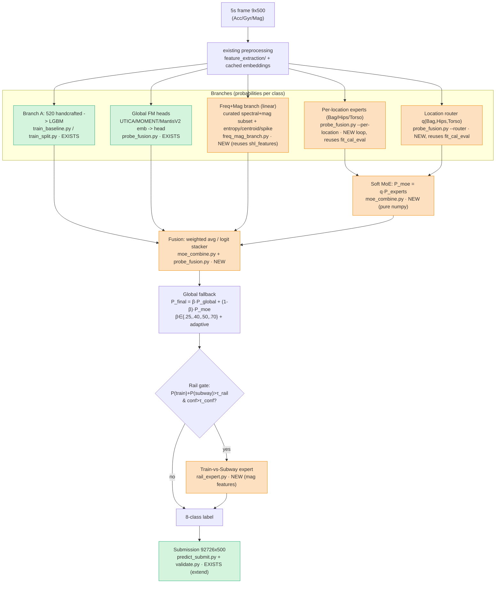

# SHL 2026 — Location-aware MoE architecture, file map & versioning

Companion to `DATA_SPLITS.md` and the approved plan. Tracks **what is what and where**, the
branch/fusion flow, and the versioning convention. Test location is **unknown** → per-location
models are *experts* combined via router/soft-MoE, never hard-routed in the submission.

## Architecture (branches → fusion → rail → submission)



## Methodological guarantees (audited)
The results can be trusted because every script enforces:
1. **No leakage into TEST.** Scaler/PCA fit on FIT only; LightGBM early-stopping +
   per-class calibration on TUNE only; router trained on FIT only. TEST is never
   used in any fit/calibration. `fit_probs` passes TEST only to *prediction*.
2. **Select on TUNE, confirm on TEST.** The best MoE config and the rail thresholds
   are chosen by **TUNE** macro-F1; TEST is read once to confirm it beats global.
   (No "best-on-TEST" cherry-picking — that bug was found and fixed in the audit.)
3. **Evaluate on the test distribution.** TUNE and TEST evaluation are restricted to
   **Bag/Hips/Torso** (the real test has no Hand) — this also keeps the 3-class
   router/oracle well-defined. FIT may include Hand (extra training data only).
4. **Oracle is a diagnostic, not deployable** — it uses the true location (unknown
   at test) and is excluded from config selection.
5. **Determinism.** `track(seed=0)` seeds Py/NumPy/Torch; LightGBM/PCA `random_state=0`;
   `split.py` is RNG-free. Git SHA recorded per MLflow run.
6. **Window-independent** (no temporal smoothing / cross-window features — test frames
   are shuffled).

## Decision gates (evidence-based; lock-test = held-out TEST)
- **G1 oracle:** per-location oracle gain over global is *large*? else experts = analysis-only.
- **G2 router:** router reliable enough that soft-MoE approaches oracle?
- **G3 submission:** location-aware / rail / any branch ships **only if it beats the global
  baseline on lock-test (TEST)**, not the selection split (TUNE).

## Planned side-experiment — VehicleExpert (subset post-processor)
A **generalization of the rail expert** (Step 8): a gated probability-space corrector
that redistributes mass *within* a confusable class subset, after **any** base pipeline
producing 8-class probabilities. Never replaces the base; never touches frozen FMs.

- **Generic core (reuse, don't duplicate):** generalize `rail_expert.apply_rail` →
  `apply_subset_expert(p_base, p_expert, subset, τ_mass, τ_conf, λ_blend)` (mass-gated +
  confidence-gated blend, renormalized). R2 becomes a special case.
- **Experts:** V4 {Car,Bus,Train,Subway}, R2 {Train,Subway}, SV5 {Still,+vehicles}
  (+ optional Road-vs-Rail). Each trained only on its subset's samples.
- **Feature groups** (auto-detected by column name, no hardcoded count): `vehicle_features`,
  `rail_features`, `frequency_features` (`freq_`/`sb_e_`/`sb_r_`/`time_ac_`), `mag_only`.
- **Leakage-safe by construction:** the expert uses `P_base` as a feature, so it is trained
  on **TUNE** (where the base's probs are out-of-sample — base fits on FIT), tuned on TUNE,
  confirmed once on **TEST**. (= the prompt's OOF intent, free from our split. No full OOF CV.)
- **Pruned matrix (anti-overfitting):** start V4 + R2 (+ SV5 if Still is confused), feature
  group `rail_features`/`vehicle_features`, input `base_proba + features`, a small τ/λ grid.
  Select on TUNE, read TEST once — avoid the multiple-comparisons-on-lock-test trap.
- **Decision (ship only if):** lock-test macro-F1 +≥0.003, **or** vehicle-subset macro-F1
  +≥0.010 with no global loss; no non-vehicle class drops >0.010; `net_gain>0`; small
  selection→lock gap. Else report as overfitting and keep disabled.
- **Evidence gate:** build *after* the base `*_RESULTS.md` land, aimed at the confusion we
  actually see (rail vs road vs Still/vehicle).
- **Output:** `vehicle_expert.py` (+ `apply_subset_expert`), `VEHICLE_EXPERT_RESULTS.md`,
  correction-diagnostics CSV, MLflow runs. Reuses `evaluate_predictions`, `track`,
  `aligned_proba`, `select_freq_mag`, the split masks, submission utils.

## File map (extend, don't rewrite)
| Component | File | Status |
|---|---|---|
| Split (FIT/TUNE/TEST) | `modeling/split.py`, `artifacts/val_split.npy` | EXISTS |
| Branch A (520 feat LGBM) | `modeling/train_baseline.py`, `train_split.py` | EXISTS |
| Global FM heads + fusion | `modeling/probe_fusion.py` | EXISTS |
| Metrics / confusion | `modeling/metrics.py` (`class_report`) | EXISTS |
| Submission + validate | `modeling/predict_submit.py`, `src/shl2026/submission/validate.py` | EXISTS |
| Freq+Mag linear branch | `modeling/freq_mag_branch.py` | NEW |
| Per-location experts + router | `modeling/probe_fusion.py` (`--per-location`, `--router`, `--rep`) | NEW |
| MoE / β-fallback / fusion combiner | `modeling/moe_combine.py` | NEW |
| Rail expert | `modeling/rail_expert.py` | NEW |
| VehicleExpert (subset post-proc) | `modeling/vehicle_expert.py` (generalizes rail) | PLANNED |
| Subject column (leakage check) | `feature_extraction/extract_features.py` | NEW |
| Result tables | `BAKEOFF_SPLIT.md`, `MOE_RESULTS.md` | EXISTS / NEW |

## MLflow logging — use the EXISTING team API (`shl2026.track`)
Do NOT roll our own MLflow wrapper. The team package already provides it:
`from shl2026 import track, evaluate_predictions` (impl `src/shl2026/tracking/autolog.py`).
`track()` reads `MLFLOW_TRACKING_URI` (group `env.sh` → `env_mdaniol.sh`), opens one run,
auto-stamps git SHA/dirty, container, Slurm job, node, grant, student, python_env, logs a
code_snapshot if dirty, and **no-ops gracefully** if MLflow is unreachable. Server =
`scripts/mlflow_server.sh` (sqlite+proxied artifacts), client+server mlflow 3.13.

Convention for our runs:
- **Experiment = `"mdaniol"`** (student-name convention; shows on the team `leaderboard()`).
- **`run_name = <config>`** (e.g. `global+softmoe_b0.40`), **`seed=0`** (track seeds Py/NumPy/Torch),
  **`params_path=None`** (our scripts use argparse, not the root `params.yaml`).
- **params:** rep, model/variant, location, β, τ_rail/τ_conf, PCA dim, n_estimators.
- **tags:** `phase` (baseline/freqmag/emb/oracle/router/moe/fusion/rail), `branch`.
- **metrics:** score with `evaluate_predictions(y_true, y_pred)` → `EvalResult`, then
  `run.log_eval(result, prefix="test_")` / `"tune_"` (logs macro_f1 + per-class incl.
  Train/Subway); add `run.log_metrics({"selection_lock_gap": ...})`.
- **artifacts:** `run.log_artifact(<per-config json>)`.
Pattern:
```python
from shl2026 import track, evaluate_predictions
with track("mdaniol", run_name=cfg, seed=0, params_path=None,
           params={...}, tags={"phase": "moe", "branch": "fusion"}) as run:
    run.log_eval(evaluate_predictions(y_test, pred_test), prefix="test_")
    run.log_metrics({"selection_lock_gap": gap})
```
The JSON/markdown tables stay as the offline record alongside MLflow.

## Versioning convention
- **Code:** git, one commit per step; message `feat(moe): <step> — <what/why>`.
- **Results:** append-only `MOE_RESULTS.md` (git-tracked) + per-config JSON `artifacts/<config>.json`
  via `save_report`. Never overwrite a prior config's row.
- **Models:** `artifacts/<branch>_<rep>_<config>.joblib` (e.g. `expert_Bag_handcrafted.joblib`).
- **Submissions:** `AGH_predictions_v<N>_<config>.txt` (e.g. `v4_global+softmoe_b0.40`) + a
  `SUBMISSIONS.md` log row: version, date, config, held-out macro-F1, file, git SHA. The chosen
  final is copied to `AGH_predictions.txt`.
- **Determinism:** fixed seeds everywhere; `split.py` already RNG-free; record git SHA + `val_split.json` counts with every result.

## Changelog
- v0 — global Branch A + FM split bake-off (baseline, current run).
- (next) v1 — freq+mag branch · v2 — emb L2/PCA heads · v3 — per-location oracle · v4 — router+MoE · v5 — rail expert.
