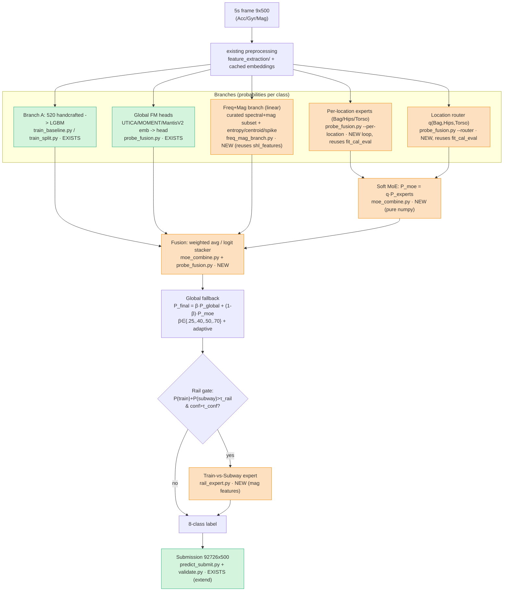

# SHL 2026 — Location-aware MoE architecture, file map & versioning

Companion to `DATA_SPLITS.md` and the approved plan. Tracks **what is what and where**, the
branch/fusion flow, and the versioning convention. Test location is **unknown** → per-location
models are *experts* combined via router/soft-MoE, never hard-routed in the submission.

## Architecture (branches → fusion → rail → submission)

## Decision gates (evidence-based; lock-test = held-out TEST)
- **G1 oracle:** per-location oracle gain over global is *large*? else experts = analysis-only.
- **G2 router:** router reliable enough that soft-MoE approaches oracle?
- **G3 submission:** location-aware / rail / any branch ships **only if it beats the global
  baseline on lock-test (TEST)**, not the selection split (TUNE).

## File map (extend, don't rewrite)
| Component | File | Status |
|---|---|---|
| Split (FIT/TUNE/TEST) | `modeling/split.py`, `artifacts/val_split.npy` | EXISTS |
| Branch A (520 feat LGBM) | `modeling/train_baseline.py`, `train_split.py` | EXISTS |
| Global FM heads + fusion | `modeling/probe_fusion.py` | EXISTS |
| Metrics / confusion | `modeling/metrics.py` (`class_report`) | EXISTS |
| Submission + validate | `modeling/predict_submit.py`, `src/shl2026/submission/validate.py` | EXISTS |
| Freq+Mag linear branch | `modeling/freq_mag_branch.py` | NEW |
| Per-location experts + router | `modeling/probe_fusion.py` (`--per-location`, `--router`, `--rep`) | NEW |
| MoE / β-fallback / fusion combiner | `modeling/moe_combine.py` | NEW |
| Rail expert | `modeling/rail_expert.py` | NEW |
| Subject column (leakage check) | `feature_extraction/extract_features.py` | NEW |
| Result tables | `BAKEOFF_SPLIT.md`, `MOE_RESULTS.md` | EXISTS / NEW |

## Versioning convention
- **Code:** git, one commit per step; message `feat(moe): <step> — <what/why>`.
- **Results:** append-only `MOE_RESULTS.md` (git-tracked) + per-config JSON `artifacts/<config>.json`
  via `save_report`. Never overwrite a prior config's row.
- **Models:** `artifacts/<branch>_<rep>_<config>.joblib` (e.g. `expert_Bag_handcrafted.joblib`).
- **Submissions:** `AGH_predictions_v<N>_<config>.txt` (e.g. `v4_global+softmoe_b0.40`) + a
  `SUBMISSIONS.md` log row: version, date, config, held-out macro-F1, file, git SHA. The chosen
  final is copied to `AGH_predictions.txt`.
- **Determinism:** fixed seeds everywhere; `split.py` already RNG-free; record git SHA + `val_split.json` counts with every result.

## Changelog
- v0 — global Branch A + FM split bake-off (baseline, current run).
- (next) v1 — freq+mag branch · v2 — emb L2/PCA heads · v3 — per-location oracle · v4 — router+MoE · v5 — rail expert.
