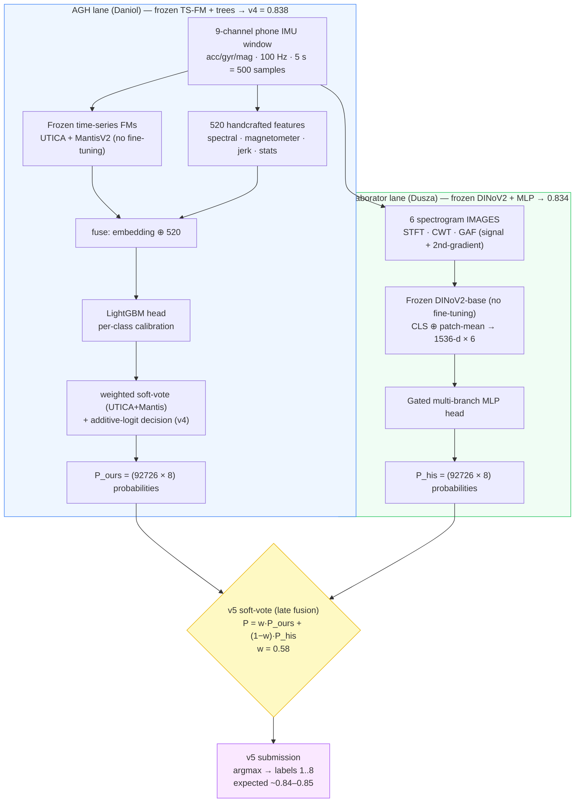
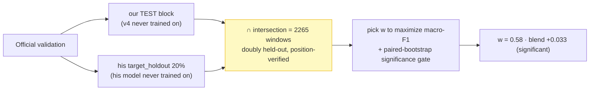

# SHL-2026 — Pipeline & v5 Combine (meeting reference)

**TL;DR.** Two *independent* frozen-foundation-model pipelines, each honest ~0.834, combined by a
leakage-clean soft-vote → **v5**. Our pipeline alone (**v4 = 0.838**) is confirmed; **v5 adds a
significant +0.033 on doubly-held-out data**, expected hidden-test **~0.84–0.85**. Submission tomorrow:
**v5 (verified) as primary, v4 (0.838) as the safe fallback.**

---

## 1. The whole approach in one diagram

**Both lanes obey the same rules:** the foundation model is **frozen** (forward-only, no gradient
through the backbone — only a lightweight trainable head); evaluation is **per-window** (the test is a
shuffled single file, no temporal smoothing / no location label).

---

## 2. The two lanes, briefly

| | **AGH lane (ours)** | **Collaborator lane (his)** |
|---|---|---|
| Representation | Frozen **time-series FMs** over raw IMU | Frozen **DINoV2** over spectrogram **images** |
| Features added | 520 handcrafted (spectral / magnetometer / jerk) | none (images only) |
| Head | **LightGBM trees** + calibration + soft-vote | **Gated multi-branch MLP** |
| Honest score | **0.838** (our held-out TEST) | **0.834** (his held-out `target_holdout`) |

> **Key fact:** two pipelines with *no shared features and a different model class* land within
> **0.0004** of each other on honest held-out data → strong evidence the ~0.834 level is **real**, not
> an overfitting artifact.

---

## 3. What v5 does — and why it helps

**v5 = late-fusion soft-vote** of the two probability matrices: `P = w·P_ours + (1−w)·P_his`, one scalar
`w = 0.58`. We do **not** merge the models (trees vs MLP) — we average their *outputs*.

**Why it works:** the two pipelines make *different* errors. His model is much stronger on **Subway
(0.93 vs our 0.79)**; ours is stronger on Car/Still. The blend takes the best of both and wins on
**Bike / Car / Bus / Train / Subway** — the confusable classes. This is the textbook ensemble payoff
from *decorrelated, competent* members (different representation **and** model class).

---

## 4. The leakage-clean weight tuning (the careful part)

`w` is tuned **only** on data that **neither** model ever trained on — so the blend can't be
"tuned to the answer".

Then that fixed `w` is applied to blend the **hidden-test** probabilities → the v5 submission.

---

## 5. Results — read these honestly

| evaluation set | ours (v4) | his | **v5 blend** | trust |
|---|---|---|---|---|
| **Doubly-held-out slice (n=2265, clean)** | 0.721 | 0.706 | **0.755** | ✅ **honest**: v5 = **+0.033, significant** (CI [+0.022, +0.046]) |
| Full validation (n=15096) | 0.839 | 0.898 | 0.901 | ⚠️ **his/v5 INFLATED** — his model trained on 60% of these rows (in-sample) |

- The **0.755 absolute is a small-slice artifact** (Run has ~43 windows → F1 = 0 there); the meaningful
  number is the **+0.033 relative gain over v4** on identical clean data.
- **Do NOT quote v5 = 0.90.** That is in-sample (resubstitution) — the same trap as the collaborator's
  internal 0.899 vs his honest 0.834.
- **Realistic hidden-test v5 ≈ 0.84–0.85**, vs **v4 = 0.838** confirmed.

---

## 6. On generalization (the last-year worry)

Last year an internal **0.93 → 0.69** on the real test — a 24-point drop is the signature of a **leaky
internal evaluation**, not normal overfitting. This year is structurally safer:
- **Honest eval** (temporal+embargo, select-on-TUNE, **lock-TEST-once**); selection gap only **~0.027**.
- **Independent cross-pipeline confirmation** (our 0.838 ≈ his 0.834).
- **Frozen FMs** (small trainable heads, low capacity to memorize).
- **v5 is an ensemble of two independent pipelines → *reduces* variance/overfitting** (a generalization
  *win*, not a risk).
- Residual risk (honest): validation→hidden-test shift (esp. Torso placement); being de-risked.

---

## 7. Submission plan (tomorrow)
1. **v5 = primary** (`AGH_predictions_v5_combine.txt`) — best score + most robust (ensemble).
2. **v4 = fallback** (`AGH_predictions_v4_vote.txt`, 0.838, fully confirmed).
3. **Before final upload:** raw-signal `--verify` of his hidden-test rows vs ours (alignment proof) +
   confirm the challenge's deadline / multiple-submission policy.
